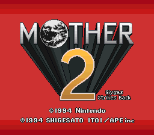
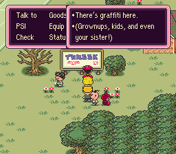
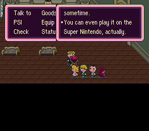
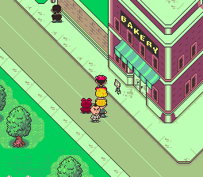
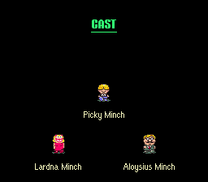
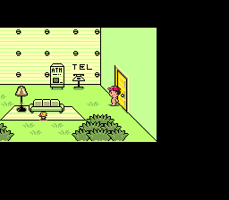
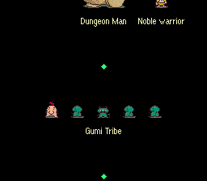

# YAM2H - Yet another Mother 2 Hack

This romhack aims to make Earthbound as close as possible to Mother 2 using the best sources available without making gameplay/graphical changes (Something never done before).

And unlike other "Restoration" or "Relocalization" hacks, this project restores details that were cut from Earthbound that most of these hackers overlooked. 
 
## Origin

Back in September 2019, I tried to port the Maternalbound Redux script to older versions of Maternalbound and shared it
to Shadowone333 as some kind of response of Redux changing a lot of things in terms of gameplay and graphics.
This leaded up to basically nothing.

5 or 6 years later, in October 2025, I discovered that CoolGuyBrendyn shared its source code
for his hack "Mother 2: Perfect Edition" and started working on it for the "funnies"
digging out the stuff I did back in 2019, starting this project.

## Changes made by this patch

* Restored MOTHER 2 sprites, graphics and maps

* Mother 2 Title Screen (Lifted from Maternalbound Redux)

* Ported the script from Maternalbound Redux (Which is based on the book "Legends of Localization: Earthbound" by Clyde Mandelin/Tomato, the creator of the Mother 3 fan-translation. making this script the most accurate of the bunch)

* Various item names are renamed to make it closer to Mother 2 (Ex: Cherub's Band to Angel's Band)

* Translated Debug Mode (Ported from Maternalbound Redux)

* Restored the CAST sequence changing colors based on the flavor you chose at the start of the game like in Mother 2

## Script changes from Maternalbound Redux

* "Dalaam" is now named "Ranma" like in Mother 2

* "Scarabia"/"Scaraba" is now named "Scarabi" like in Mother 2

* "Tendas" are now named "Gummy" like in Mother 2

* Fixed various inconsistencies and localization errors from the script

* Two instances where a dialogue line has an official uncensored version

## Screenshots

## Known Issues

* The title screen is not 1:1 to the japanese version of Mother 2. This is because the title screen in Earthbound is handled in such a different way than it does in Mother 2

## Where do I download this hack?

Download the patches from the [Release](https://github.com/Masaru2/YAM2H/releases) page.

## How to patch

1. Download the patch from the Release page

2. Apply the patch to the following rom:

`Database match: EarthBound (USA)`

`Database: No-Intro: Super Nintendo Entertainment System (v. 20210222-050638)`

`File/ROM SHA-1: D67A8EF36EF616BC39306AA1B486E1BD3047815A`

`File/ROM CRC32: DC9BB451`

for tools to patch a rom, I'd recommend the following tools:
-[Floating IPS by Alcaro](https://www.smwcentral.net/?a=details&id=11474&p=section)
-[Rompatcher.js by Marc Robledo](https://www.marcrobledo.com/RomPatcher.js/)

3. Load the patched rom to the emulator of choice

## Building

It can be compiled through the tool [Coilsnake 4.2](https://pk-hack.github.io/CoilSnake/).

## Special Thanks

Clyde Mandelin/Tomato - For creating both webpage and book of Legends of Localization for Earthbound/Mother 2

CoolGuyBrendyn - For the source code of "Mother 2: Perfect Edition" which served as a base for the project

ShadowOne333 - For creating Maternalbound Redux

Ethereal - For suggesting what changes I should do for this project

Phoenixbound - For the ASM code to restore the flavor colors in the CAST sequence